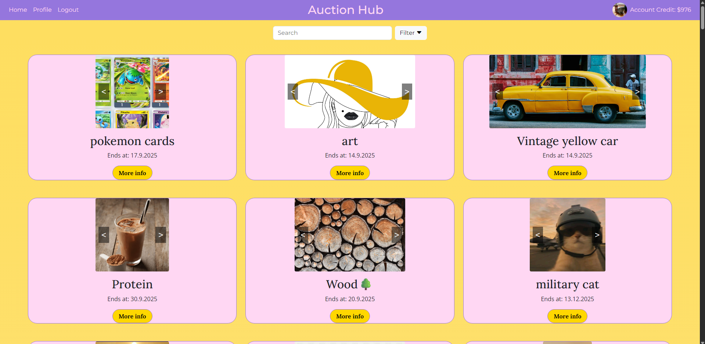

# Semester-Project-2



This project is a responsive auction site where users can create a profile, bid on different listings, create their own listings and customize their profile.

## Features
- User login
- User registration
- Create, edit and delete listings
- View listings and place bids
- View bidding history
- User profile management and customisation
- Responsive design for desktop and mobile

## Technologies
- HTML
- CSS
- Vanilla Javascript
- Fetching API (https://v2.api.noroff.dev/auction/listings)
- GitHub Pages

## Setup and installation

1. Clone the repository:
   ```bash
   git clone https://github.com/vicbro00/Semester-Project-2.git

2. Navigate to the project folder

    cd Semester-Project-2

3. Open the index.html page in a browser of your choice

4. Find the register page and register your own user using a stud.noroff.no email

5. Browse and bid on listings, or create your own listings

## Folder structure

/css/styles.css
/js/api
/js/ui
/listings/html
/profile/html
index.html
main.js

## Contributions

Feel free to contribute with your own improvements. Make a pull request on the github page, and open an issue including the changes you suggest

## Testing

npm start

## The live page: https://vicbro00.github.io/Semester-Project-2/index.html

## All deliverables:

Links to Semester Project 2 Delivery

Link to Kanban Board:
	https://github.com/users/vicbro00/projects/13

Link to Gannt chart:
	https://github.com/users/vicbro00/projects/13/views/4

Link to Figma Style Guide:
	https://www.figma.com/design/OFjFmqXhrndHmIvM6c12ca/Semester-Project-2?node-id=2-19&p=f

Link to Figma design:
	https://www.figma.com/design/OFjFmqXhrndHmIvM6c12ca/Semester-Project-2?node-id=0-1&p=f
	https://www.figma.com/design/OFjFmqXhrndHmIvM6c12ca/Semester-Project-2?node-id=1-3&p=f

Link to Github Repository:
	https://github.com/vicbro00/Semester-Project-2

Link to deployed web application:
	https://vicbro00.github.io/Semester-Project-2/index.html

Link to reflection document (PDF):
	file:///C:/Projects-copy/Semester-Project-2/Reflection%20Semester%20Project%202.pdf